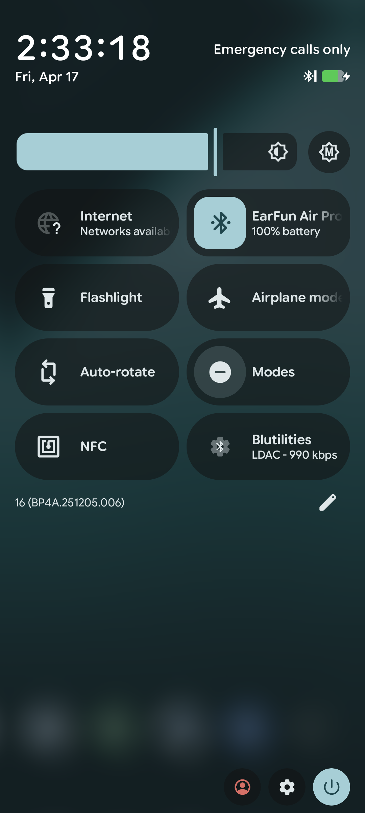
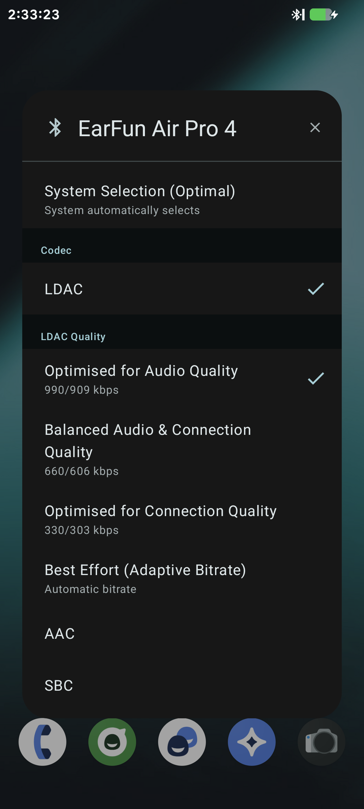

[English](README.md) | **Magyar**

  

<h1 align="center">Blutilities</h1>

  <strong>Bluetooth audio kodekek kezelése közvetlenül a Gyorsbeállításokból.</strong>

 

## Áttekintés

A **Blutilities** egy egyszerű, Material Design stílusú Android app, amely a MosaicOS Beta 8 egyik funkcióját teszi elérhetővé kompatibilis Android-eszközökön, így gyerekjátékká válik a Bluetooth-audio kezelése. Ahelyett, hogy az Android fejlesztői beállításai között kellene kutatnunk, a Blutilities kényelmes **Gyorsbeállítás-csempét** kínál, amellyel menet közben válthatunk az aktív audiokodekek között.

Az alkalmazást audiofilek számára tervezték, és széles körű támogatást nyújt a nagy felbontású kodekekhez – különösen az **LDAC**-hez, lehetővé téve, hogy könnyedén meghatározd a lejátszási minőségeket (pl. 990 kbps, 660 kbps) a csatlakoztatott A2DP-eszközökön.

## Főbb jellemzők

* **Gyorsbeállítások integrációja:** Egy érintéssel elérhető az aktív Bluetooth-hangkonfiguráció. A csempe felirata mutatja az éppen használt kodeket, LDAC esetén a bitrátával együtt.
* **Intelligens kodekváltás:** A választó az Android által választhatónak jelzett kodekeket sorolja fel. Android 15-től a rendszer adja meg a kodekek nevét és azonosítóját, régebbi verziókon a szabványos Android-kodekazonosítókat használja. Az elérhetetlen vagy megtagadott kodekhozzáférést üzenet jelzi.
* **Részletes LDAC-vezérlés:** A rendszer alapértelmezett beállításait felülírva manuálisan kiválasztható a kívánt LDAC lejátszási minőség (990/909 kbps, 660/606 kbps, 330/303 kbps vagy adaptív bitráta).
* **Vezérlés visszaadása:** A **Rendszer választása (Optimális)** bejegyzés megmutatja, hogyan állítható vissza az automatikus választás a Fejlesztői beállításokban, az alkalmazás nem tudja megbízhatóan visszaállítani a Bluetooth-rendszer kodekprioritásait.
* **Material Design felhasználói felület:** A Material You színeit követő párbeszédablak, amelyet közvetlenül a csempéről indított képernyő jelenít meg, így az engedélykérések és az eszközhozzáférés jóváhagyása megbízhatóan megnyílhat.
* **Kontextusérzékeny:** A csempe a Gyorsbeállítások megnyitásakor frissül, és beállítás, betöltés vagy leválasztott eszköz esetén is érinthető marad. Több csatlakoztatott eszköznél az aktív A2DP-eszközt használja, vagy jelzi, ha az aktív eszköz nem azonosítható.

## Követelmények

* Android 13 (API 33) vagy újabb
* Csatlakoztatott A2DP Bluetooth hangeszköz

## Támogatott nyelvek
* Angol
* Magyar

Fordításokat szívesen fogadunk.

## Képernyőképek

   &nbsp;&nbsp;&nbsp;&nbsp;
  

## Használat

1. Telepítse az alkalmazást.
2. Húzza le kétszer az ujját a kiterjesztett Gyorsbeállítások panel megnyitásához.
3. Érintse meg a **Szerkesztés** (ceruza) ikont.
4. Keresse meg a **Blutilities** alkalmazást a rendelkezésre álló csempék között, és húzza át az aktív csempék területére.
5. Csatlakoztassa a Bluetooth fejhallgatót/fülhallgatót.
6. Érintse meg a csempét a kodekválasztó megnyitásához.
7. Amikor először nyitja meg a választót egy eszközhöz, az Android engedélyt kér arra, hogy a Blutilities kezelhesse az adott eszközt. Hagyja jóvá – ezután jelenik meg a kodeklista.

## Engedélyek

| Engedély | Mire kell |
| --- | --- |
| `BLUETOOTH_CONNECT` | A csatlakoztatott eszköz felismerése, a támogatott kodekek beolvasása és a választott beállítás alkalmazása. Az alkalmazás az első használatkor kéri. |
| `BLUETOOTH`, `BLUETOOTH_ADMIN` | Régebbi rendszerekkel való kompatibilitás miatt deklarált engedélyek. |
| `BLUETOOTH_PRIVILEGED` | Rendszeralkalmazásként történő telepítéshez deklarált engedély, normál telepítésnél nem jár, helyette eszközönkénti társeszköz-társítás szükséges. |

A kodekek beolvasása és írása a `BluetoothA2dp.getCodecStatus` és `setCodecConfigPreference` `@hide` platform API-kon keresztül, reflexióval történik, ezért a pontos működés a ROM Bluetooth-stackjétől függ. Az alkalmazás nem kér kivételt a háttérben futásra vagy a háttérbeli adatforgalomra. A kodekváltást csak akkor jelzi sikeresnek, ha a rendszer által jelentett beállítás megfelel a kérésnek.

---
*Kotlin nyelven készült.*
